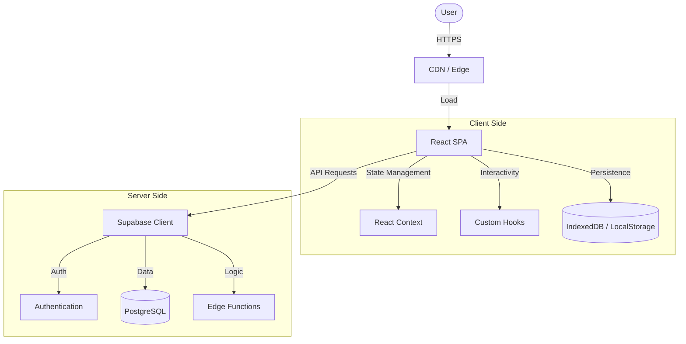

<div align="center">

# Jiang's Tab
### Your Personal Web Gateway

<p align="center">
  
</p>

[](https://opensource.org/licenses/Apache-2.0)
[](https://reactjs.org/)
[](https://www.typescriptlang.org/)
[](https://vitejs.dev/)
[](https://supabase.com/)

[🌐 Live Demo](https://jiangjiang.cc) · [🐛 Report Bug](https://github.com/jiangjianghong/jiang_ai_web/issues) · [✨ Request Feature](https://github.com/jiangjianghong/jiang_ai_web/issues)

**[ English | [简体中文](README.zh-CN.md) ]**

</div>

## 📚 Table of Contents

- [Introduction](#-introduction)
- [Key Features](#-key-features)
- [Tech Stack](#-tech-stack)
- [Getting Started](#-getting-started)
- [Architecture](#-architecture-overview)
- [Deployment](#-deployment)
- [Database Setup](#-database-setup-supabase)
- [Roadmap](#-roadmap)
- [Contributing](#-contributing)
- [License](#-license)

---

## 📖 Introduction

**Jiang's Tab** is not just another browser start page. It is a **modern, highly customizable, and visually stunning** personal dashboard designed to make your daily web navigation a delight.

Built with performance and aesthetics in mind, it combines robust bookmark management with a beautiful interface that adapts to your style. Whether you need a productivity hub with Notion integration or a serene space with daily changing wallpapers and poetry, Jiang's Tab adapts to *you*.

## ✨ Key Features

### 🎨 Visual & UI
> **Experience a workspace that breathes.**
- **Dynamic Wallpapers** - Starts your day with a fresh, high-res background from Unsplash.
- **Parallax Effects** - Interactive depth that responds to your mouse movement.
- **Glassmorphism** - Modern frosted glass aesthetics with customizable transparency.
- **Theme Engine** - Seamless toggling between Light and Dark modes.
- **Responsive** - Flawless experience on desktop, tablet, and mobile.

### 🛠️ Core Functionality
> **Everything you need, right where you need it.**
- **Smart Bookmarks** - Drag & drop organization with auto-fetched icons.
- **Cloud Sync** - Never lose your setup. Syncs across devices via Supabase.
- **Efficiency** - Global search bar to find bookmarks or search the web instantly.
- **Offline Ready** - Full PWA support—install it as a native app.
- **Privacy First** - Your data is yours. Secure authentication and storage.

### 🧩 Integrations & Widgets
> **More than just links.**
- **Notion Workspace** - Connect your Notion databases for a seamless workflow.
- **Daily Poetry** - A touch of culture with random Chinese poetry generation.
- **Time & Date** - Elegant clock widget to keep you on track.
- **Todo List** - Built-in task management to capture ideas quickly.

### ⚡ Performance
> **Speed as a feature.**
- **Blazing Fast** - Powered by Vite and React for instant load times.
- **Smart Caching** - Multi-layer caching strategy (Memory + IndexedDB).
- **Edge Computing** - Supabase Edge Functions for low-latency backend operations.

---

## 🛠️ Tech Stack

This project leverages the latest web technologies to ensure scalability, maintainability, and top-tier performance.

| Category | Technologies |
|----------|--------------|
| **Frontend** |     |
| **State** |    |
| **Backend** |    |
| **UX & Motion** |    |
| **Tools** |    |

---

## 🚀 Getting Started

Ready to build your own gateway? Follow these simple steps.

### Prerequisites
- **Node.js** >= 18.0.0
- **pnpm** >= 8.0.0 (Recommended) or npm

### Installation

1. **Clone the repository**
   ```bash
   git clone https://github.com/jiangjianghong/jiang_ai_web.git
   cd jiang_ai_web
   ```

2. **Install dependencies**
   ```bash
   pnpm install
   ```

3. **Configure Environment**
   Copy the example env file and fill in your Supabase credentials.
   ```bash
   cp .env.example .env
   ```

4. **Start Development**
   ```bash
   pnpm dev
   ```
   Open [http://localhost:3000](http://localhost:3000) to view it in the browser.

---

## 📦 Deployment

### Option A: GitHub Pages (Automated & Free)

This project includes a built-in [GitHub Action](.github/workflows/deploy.yml) that automatically builds and deploys to GitHub Pages when you push to the `main` branch.

**1. Fork & Settings**
   - Fork this repository.
   - Go to **Settings** > **Pages**.
   - Under **Build and deployment** > **Source**, select **GitHub Actions**.

**2. Configure Secrets (Critical!)**
   To ensure the build can access your Supabase project, you must set up Repository Secrets.
   - Go to **Settings** > **Secrets and variables** > **Actions**.
   - Click **New repository secret**.
   - Add the following two secrets (values from your Supabase Project Settings):
     - `VITE_SUPABASE_URL`
     - `VITE_SUPABASE_ANON_KEY`

**3. Trigger Deployment**
   - Push a commit to `main`, or manually run the workflow via the **Actions** tab.

> **⚠️ Note on Base Path**: The default configuration assumes a **Custom Domain** (e.g., `your-site.com`) or Root Domain. If you are deploying to a sub-path (e.g., `username.github.io/repo-name`), you must:
> 1. Open `vite.config.ts`.
> 2. Change `base: '/'` to `base: '/repo-name/'`.

### Option B: Vercel (Recommended for Speed)

Vercel provides zero-configuration deployment for Vite apps.

1. **Import Project**: Go to Vercel Dashboard and "Add New > Project".
2. **Select Repo**: Choose your forked repository.
3. **Environment Variables**: Add the Supabase keys:
   - `VITE_SUPABASE_URL`
   - `VITE_SUPABASE_ANON_KEY`
4. **Deploy**: Click Deploy. Vercel handles the rest (rewrites, HTTPS, etc.).

---

## 🗄️ Database Setup (Supabase)

This project relies on Supabase for Auth & Database.

<details>
<summary><b>1️⃣ SQL Schema Setup (One-Click)</b></summary>

We provide a **unified deployment script** that sets up all tables (`profiles`, `settings`, `websites`, `stats`), security policies, and storage buckets automatically.

1. Copy the content of **[supabase_deploy.sql](supabase_deploy.sql)**.
2. Paste it into your **Supabase SQL Editor**.
3. Click **Run**.

That's it! Your database is fully configured.

</details>

<details>
<summary><b>3️⃣ Edge Functions</b></summary>

Deploy the provided Edge Functions for advanced features:
```bash
supabase functions deploy favicon-service --no-verify-jwt
supabase functions deploy wallpaper-service --no-verify-jwt
supabase functions deploy notion-proxy --no-verify-jwt
```
</details>

---

## 🏗️ Architecture Overview

The project follows a clean, modular structure designed for scalability.



### Project Structure

```bash
src/
├── 🧩 components/      # Reusable UI bricks (Atoms, Molecules)
│   ├── 🧱 common/      # Generic components (Buttons, Inputs)
│   └── ⚙️ widget/      # Complex widgets (Calendar, Weather)
├── 📦 contexts/        # Global state management (Auth, Theme)
├── 🪝 hooks/           # Custom React hooks (Logic extraction)
├── 🛠️ lib/             # Utilities & API clients
│   ├── 🔄 api/         # External API integrations
│   └── 💾 storage/     # Local storage adapters
├── 📄 pages/           # Route views (Lazy loaded)
└── 🎨 index.css        # Global styles & Tailwind
```

For a deep dive into the backend setup, check out the [Database Setup Guide](#-database-setup) in the expanded documentation.

---

## 🗺️ Roadmap

- [x] **v1.0**: Initial Release with Dynamic Wallpapers & Bookmarks
- [x] **v1.1**: User Auth & Cloud Sync Support
- [x] **v1.2**: Notion Integration & SEO Optimization
- [ ] **v2.0**: Mobile Native App (React Native)
- [ ] **Future**: AI-powered Bookmark Categorization
- [ ] **Future**: Public Shareable Dashboards

See the [open issues](https://github.com/jiangjianghong/jiang_ai_web/issues) for a full list of proposed features (and known issues).

---

## 🤝 Contributing

Contributions are what make the open source community such an amazing place to learn, inspire, and create. Any contributions you make are **greatly appreciated**.

Please read our [Contributing Guidelines](CONTRIBUTING.md) for details on our code of conduct, and the process for submitting pull requests to us.

1. Fork the Project
2. Create your Feature Branch (`git checkout -b feature/AmazingFeature`)
3. Commit your Changes (`git commit -m 'feat: Add some AmazingFeature'`)
4. Push to the Branch (`git push origin feature/AmazingFeature`)
5. Open a Pull Request

---

## 📈 Star History

<a href="https://star-history.com/#jiangjianghong/jiang_ai_web&Date">
 <picture>
   <source media="(prefers-color-scheme: dark)" srcset="https://api.star-history.com/svg?repos=jiangjianghong/jiang_ai_web&type=Date&theme=dark" />
   <source media="(prefers-color-scheme: light)" srcset="https://api.star-history.com/svg?repos=jiangjianghong/jiang_ai_web&type=Date" />
   
 </picture>
</a>

## 👥 Contributors

<a href="https://github.com/jiangjianghong/jiang_ai_web/graphs/contributors">
  
</a>

---

## 📄 License

Distributed under the Apache 2.0 License. See `LICENSE` for more information.

---

<div align="center">
  
  Created with ❤️ by **[Jiang](https://github.com/jiangjianghong)**
  
  [Twiter/X](https://twitter.com) · [Blog](https://jiangjiang.cc/blog) · [Email](mailto:contact@jiangjiang.cc)

</div>
