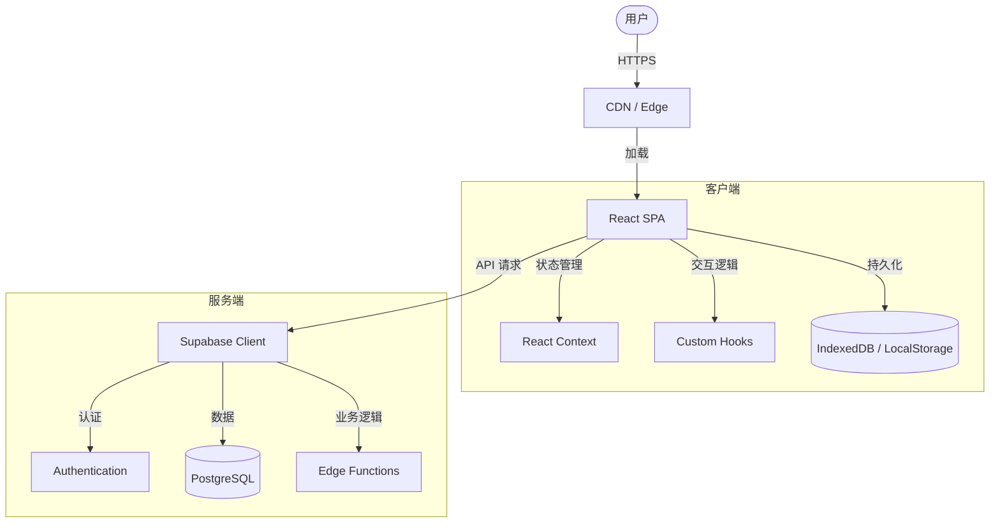

<div align="center">


# 西红柿标签页 (Tomato Tabs)
### 你的个人网络门户

https://github.com/user-attachments/assets/66627637-b57b-4973-8f68-977905b84fd1

<p align="center">
  
</p>

<p align="center">
  
</p>

[](https://opensource.org/licenses/Apache-2.0)
[](https://reactjs.org/)
[](https://www.typescriptlang.org/)
[](https://vitejs.dev/)
[](https://supabase.com/)

[🌐 在线演示](https://jiangjiang.cc) · [🐛 报告问题](https://github.com/jiangjianghong/tomato-tab/issues) · [✨ 功能建议](https://github.com/jiangjianghong/tomato-tab/issues)

**[ [English](README.md) | 简体中文 ]**

</div>

## 📚 目录

- [项目简介](#-简介)
- [核心特性](#-核心特性)
- [技术栈](#-技术栈)
- [快速开始](#-快速开始)
- [架构设计](#-架构概览)
- [部署指南](#-部署指南)
- [数据库配置](#-数据库配置-supabase)
- [路线图](#-路线图)
- [参与贡献](#-参与贡献)
- [许可证](#-许可证)

---

## 📖 简介

**西红柿标签页** 不仅仅是另一个浏览器起始页。它是一个**现代化、高度可定制且视觉惊艳**的个人仪表盘，旨在让你的每日网络浏览体验令人愉悦。

我们在构建时兼顾了性能与美学，将强大的书签管理与随你风格而变的精美界面相结合。无论你需要一个集成了 Notion 的高效工作中心，还是一个伴随每日壁纸和诗词的宁静空间，西红柿标签页 都能完美适配**你**的需求。

## ✨ 核心特性

### 🎨 视觉与界面
> **体验会呼吸的工作区**
- **动态壁纸** - 每日自动通过 Bing 更新高清背景，开启清新一天。
- **视差效果** - 跟随鼠标移动的交互式景深效果。
- **毛玻璃美学** - 现代化的磨砂玻璃质感，支持自定义透明度。
- **主题引擎** - 无缝切换明亮与暗黑模式。
- **响应式设计** - 在桌面、平板和手机上都能获得完美体验。

### 🛠️ 功能特性
> **所需一切，触手可及**
- **智能书签** - 支持拖拽排序，自动获取精美图标。
- **云端同步** - 基于 Supabase，跨设备无缝同步，配置永不丢失。
- **高效搜索** - 全局搜索栏，瞬间找到书签或直达网络搜索。
- **离线就绪** - 完整的 PWA 支持——像原生应用一样安装和使用。
- **隐私优先** - 你的数据属于你。安全的用户认证与加密存储。

### 🧩 集成与组件
> **不仅仅是链接**
- **Notion 工作区** - 连接你的 Notion 数据库，打造无缝工作流。
- **每日诗词** - 随机生成中国古诗词，增添一份文化底蕴。
- **时钟组件** - 优雅的时间日期显示，让你时刻把握当下。
- **待办清单** - 内置任务管理，快速捕捉每一个灵感。

### ⚡ 极致性能
> **速度即正义**
- **极速加载** - 由 Vite 和 React 驱动，通过代码分割实现秒开。
- **智能缓存** - 多层级缓存策略（内存 + IndexedDB），流畅如丝。
- **边缘计算** - 利用 Supabase Edge Functions 实现低延迟后端操作。

---

## 🛠️ 技术栈

本项目采用最新的 Web 技术栈构建，以确保可扩展性、可维护性和顶级性能。

| 分类 | 技术方案 |
|----------|--------------|
| **前端框架** |     |
| **状态管理** |    |
| **后端服务** |    |
| **交互与动画** |    |
| **工具链** |    |

---

## 🚀 快速开始

准备好打造你自己的专属门户了吗？只需简单几步。

### 环境要求
- **Node.js** >= 18.0.0
- **pnpm** >= 8.0.0 (推荐) 或 npm

### 安装步骤

1. **克隆仓库**
   ```bash
   git clone https://github.com/jiangjianghong/tomato-tab.git
   cd tomato-tab
   ```

2. **安装依赖**
   ```bash
   pnpm install
   ```

3. **配置环境变量**
   复制示例环境变量文件并填入你的 Supabase 配置。
   ```bash
   cp .env.example .env
   ```

4. **启动开发环境**
   ```bash
   pnpm dev
   ```
   打开 [http://localhost:3000](http://localhost:3000) 即可在浏览器中查看。

---

## 📦 部署指南

### 方案 A：GitHub Pages (自动 & 免费)

本项目内置了 [GitHub Action](.github/workflows/deploy.yml)，任何推送到 `main` 分支的代码都会自动构建并发布。

**1. Fork 与设置**
   - Fork 本仓库到你的账号。
   - 进入仓库 **Settings** > **Pages**。
   - 在 **Build and deployment** > **Source** 中，选择 **GitHub Actions**。

**2. 配置密钥 (关键步骤！)**
   为了让构建过程能连接到你的 Supabase 数据库，必须配置仓库密钥。
   - 进入 **Settings** > **Secrets and variables** > **Actions**。
   - 点击 **New repository secret**。
   - 添加以下两个密钥（值来自你的 Supabase 项目设置）：
     - `VITE_SUPABASE_URL`
     - `VITE_SUPABASE_ANON_KEY`

**3. 触发部署**
   - 向 `main` 分支推送代码，或在 **Actions** 选项卡手动触发工作流。

> **⚠️ 关于路径配置**: 默认配置假定你使用 **自定义域名** (如 `your-site.com`) 或根域名。如果你部署在子路径 (如 `username.github.io/repo-name`)，请务必：
> 1. 打开 `vite.config.ts`。
> 2. 将 `base: '/'` 修改为 `base: '/repo-name/'`。

### 方案 B：Vercel (推荐，速度极快)

Vercel 对 Vite 应用提供零配置支持。

1. **导入项目**: 在 Vercel 控制台点击 "Add New > Project"。
2. **选择仓库**: 选择你 Fork 的仓库。
3. **环境变量**: 同样需要添加 Supabase 密钥：
   - `VITE_SUPABASE_URL`
   - `VITE_SUPABASE_ANON_KEY`
4. **点击部署**: Vercel 会自动处理重写规则、HTTPS 等配置。

---

## 🗄️ 数据库配置 (Supabase)

即使是静态部署，也需要配置 Supabase 以支持云端同步。

<details>
<summary><b>1️⃣ SQL 数据库初始化 (一键配置)</b></summary>

我们提供了一个**统一部署脚本**，可以自动创建所有数据表（资料、设置、网站、统计、公告、管理员）、安全策略以及存储桶。

1. 复制 **[supabase_deploy.sql](supabase_deploy.sql)** 文件的全部内容。
2. 粘贴到你的 **Supabase SQL Editor** 中。
3. 点击 **Run** 运行。

搞定！你的数据库已经完全配置好了。

</details>

<details>
<summary><b>2️⃣ 管理员配置 (可选)</b></summary>

如果你想启用管理后台功能，请执行以下步骤：

**1. 配置环境变量**

在 `.env` 文件中添加管理员邮箱：
```bash
VITE_ADMIN_EMAIL=your-admin@example.com
```

**2. 设置管理员角色**

在 Supabase SQL Editor 中执行：
```sql
UPDATE user_profiles SET role = 'super_admin' WHERE email = 'your-admin@example.com';
```

**3. 访问管理后台**

使用管理员账号登录后，访问 `/admin` 即可进入管理后台。

**管理后台功能包括：**
- 📊 **仪表盘** - 数据可视化图表（折线图、柱状图）
- 👥 **用户管理** - 用户列表、详情查看、禁用/解禁
- 📈 **行为分析** - 活跃时段分布、用户角色分布、热门搜索词
- ⚡ **实时监控** - 在线用户、Realtime 订阅
- 📢 **公告管理** - 创建、编辑、删除公告
- 📋 **操作日志** - 管理员操作审计记录
- ⚙️ **系统监控** - API 健康检测、响应时间

> ⚠️ **隐私说明**：管理员只能查看聚合统计数据，无法访问用户的网站列表等个人数据。

</details>

<details>
<summary><b>3️⃣ 边缘函数 (Edge Functions)</b></summary>

如需高级功能，请部署提供的边缘函数：
```bash
supabase functions deploy favicon-service --no-verify-jwt
supabase functions deploy wallpaper-service --no-verify-jwt
supabase functions deploy notion-proxy --no-verify-jwt
```
</details>

---

## 🏗️ 架构概览

项目采用清晰的模块化结构，为便于扩展而设计。



### 项目结构

```bash
src/
├── 🧩 components/      # 可复用的 UI 组件积木 (Atoms, Molecules)
│   ├── 🧱 common/      # 通用组件 (Buttons, Inputs)
│   └── ⚙️ widget/      # 复杂挂件 (Calendar, Weather)
├── 📦 contexts/        # 全局状态管理 (Auth, Theme)
├── 🪝 hooks/           # 自定义 React Hooks (逻辑抽离)
├── 🛠️ lib/             # 工具函数与 API 客户端
│   ├── 🔄 api/         # 外部 API 集成
│   └── 💾 storage/     # 本地存储适配器
├── 📄 pages/           # 页面视图路由 (懒加载)
└── 🎨 index.css        # 全局样式与 Tailwind
```

如需深入了解后端设置，请参阅完整文档中的 [数据库配置指引](README.md#-database-setup)。

---

## 🗺️ 路线图

- [x] **v1.0**: 初始版本，支持动态壁纸与书签管理
- [x] **v1.1**: 用户认证与云端同步支持
- [x] **v1.2**: Notion 集成与 SEO 优化
- [ ] **v2.0**: 移动端原生应用 (React Native)
- [ ] **规划中**: AI 驱动的书签智能分类
- [ ] **规划中**: 可公开分享的仪表盘

查看 [Issue 列表](https://github.com/jiangjianghong/tomato-tab/issues) 了解完整规划（以及已知问题）。

## TODO

- 调整部分滑块设置时（例如搜索框圆角），设置本身变成透明，松手恢复，这样可以直观的看到设置效果
- AI 图标更好的表现形式（已经新增一种）
- 更多的壁纸源，包括动态壁纸
- 自定义搜索引擎
- [x] 氛围效果，例如下雪（已支持）
- [x] Admin 后台精确用户活跃时间显示
- [x] Admin 后台数据可视化图表
- [x] Admin 后台实时监控功能
- [x] Admin 后台操作日志审计


---

## 🤝 参与贡献

开源社区之所以如此精彩，正是因为有像你这样的贡献者。我们**非常感谢**任何形式的贡献。

请阅读我们的 [贡献指南](CONTRIBUTING.md) 了解代码行为准则以及提交 Pull Request 的流程。

1. Fork 本项目
2. 创建你的特性分支 (`git checkout -b feature/AmazingFeature`)
3. 提交你的改动 (`git commit -m 'feat: Add some AmazingFeature'`)
4. 推送到分支 (`git push origin feature/AmazingFeature`)
5. 开启 Pull Request

---

## 📈 Star 趋势

<a href="https://star-history.com/#jiangjianghong/tomato-tab&Date">
 <picture>
   <source media="(prefers-color-scheme: dark)" srcset="https://api.star-history.com/svg?repos=jiangjianghong/tomato-tab&type=Date&theme=dark" />
   <source media="(prefers-color-scheme: light)" srcset="https://api.star-history.com/svg?repos=jiangjianghong/tomato-tab&type=Date" />
   
 </picture>
</a>

## 👥 贡献者

<a href="https://github.com/jiangjianghong/tomato-tab/graphs/contributors">
  
</a>

---

## 📄 许可证

基于 Apache 2.0 许可证分发。详见 `LICENSE` 文件。

---

<div align="center">
  
  Created with ❤️ by **[Jiang](https://github.com/jiangjianghong)**
  
  [Twiter/X](https://twitter.com) · [Blog](https://jiangjiang.cc/blog) · [Email](mailto:contact@jiangjiang.cc)

</div>
