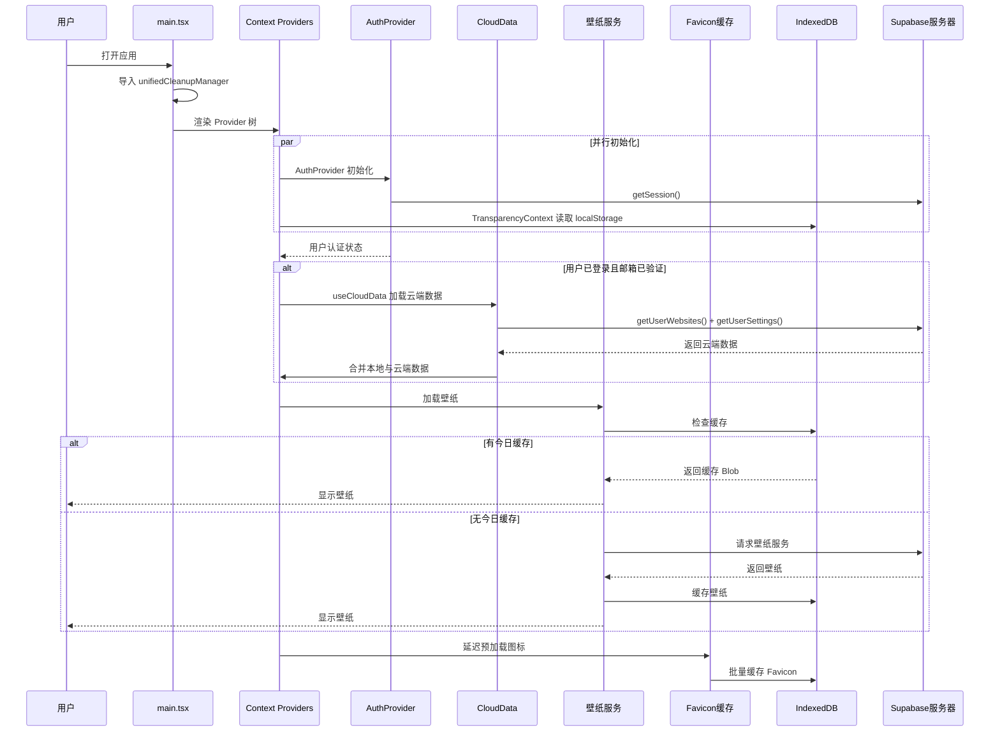
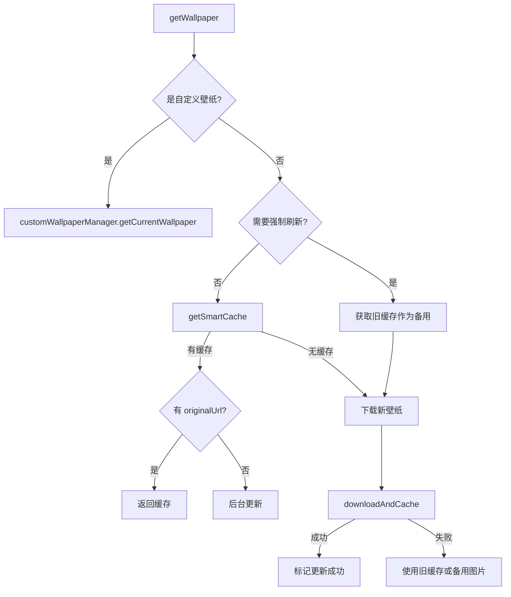

# 应用启动流程详细分析

## 概述

本文档详细分析了 Tomato Tab 应用启动时执行的所有操作，包括网络请求、本地计算、缓存加载和更新。分析区分了**首次启动**和**后续启动**两种场景。

---

## 启动流程时序图



---

## 一、入口文件初始化 (`main.tsx`)

### 1.1 模块导入阶段（同步）

| 操作 | 类型 | 首次启动 | 后续启动 |
|------|------|----------|----------|
| 导入 React/ReactDOM | 本地计算 | ✅ | ✅ |
| 导入 BrowserRouter | 本地计算 | ✅ | ✅ |
| 导入 `unifiedCleanupManager` | 本地计算 + 初始化 | ✅ | ✅ |
| 导入 CSS 样式 | 本地计算 | ✅ | ✅ |

### 1.2 UnifiedCleanupManager 初始化

**文件**: [unifiedCleanupManager.ts](file:///c:/Users/19404/tomato-tab/src/lib/unifiedCleanupManager.ts)

```typescript
// 构造函数立即执行
constructor() {
  this.startCleanup(); // 启动定时清理
}
```

| 操作 | 详情 |
|------|------|
| 启动定时清理器 | 每 5 分钟执行一次清理任务 |
| 注册 `beforeunload` 事件 | 页面关闭时清理定时器 |
| 执行 `faviconCache.cleanupExpiredBlobUrls()` | 清理过期的 Blob URL |
| 执行 `memoryManager.cleanup()` | 清理内存 |

---

## 二、Context Provider 初始化链

Provider 嵌套顺序：

```
DndProvider → TransparencyProvider → AuthProvider → SyncProvider → UserProfileProvider → AdminProvider → WorkspaceProvider → AppContent
```

### 2.1 TransparencyProvider（设置上下文）

**文件**: [TransparencyContext.tsx](file:///c:/Users/19404/tomato-tab/src/contexts/TransparencyContext.tsx)

#### 本地存储读取（同步）

在组件初始化时，通过 `useState` 初始化函数同步读取 localStorage：

| 设置项 | localStorage Key | 默认值 |
|--------|------------------|--------|
| 卡片透明度 | `cardOpacity` | 0.1 |
| 搜索栏透明度 | `searchBarOpacity` | 0.1 |
| 视差效果 | `parallaxEnabled` | true |
| 壁纸分辨率 | `wallpaperResolution` | 根据设备屏幕判断 |
| 卡片颜色 | `cardColor` | "255, 255, 255" |
| 搜索栏颜色 | `searchBarColor` | "255, 255, 255" |
| 自动同步开关 | `autoSyncEnabled` | true |
| 自动同步间隔 | `autoSyncInterval` | 30 秒 |
| 搜索新标签页 | `searchInNewTab` | true |
| 自动排序 | `autoSortEnabled` | false |
| 时间组件显示 | `timeComponentEnabled` | true |
| 显示完整日期 | `showFullDate` | true |
| 显示秒数 | `showSeconds` | true |
| 显示星期 | `showWeekday` | true |
| 显示年份 | `showYear` | true |
| 显示月份 | `showMonth` | true |
| 显示日期 | `showDay` | true |
| 日期显示模式 | `dateDisplayMode` | "yearMonthDay" |
| 搜索栏圆角 | `searchBarBorderRadius` | 9999 |
| 动画样式 | `animationStyle` | "simple" |
| 下班倒计时 | `workCountdownEnabled` | false |
| 午休时间 | `lunchTime` | "12:00" |
| 下班时间 | `offWorkTime` | "18:00" |
| AI图标模式 | `aiIconDisplayMode` | "circular" |
| 氛围效果 | `atmosphereEnabled` | true |
| 氛围粒子数 | `atmosphereParticleCount` | 100 |
| 暗角遮罩 | `darkOverlayEnabled` | false |
| 遮罩模式 | `darkOverlayMode` | "off" |
| 夜间模式 | `theme` | 跟随系统 |

**首次启动 vs 后续启动**:
- **首次启动**: 所有 localStorage 读取返回 null，使用默认值
- **后续启动**: 读取用户之前保存的设置

---

### 2.2 AuthProvider（认证上下文）

**文件**: [SupabaseAuthContext.tsx](file:///c:/Users/19404/tomato-tab/src/contexts/SupabaseAuthContext.tsx)

#### 网络操作

| 操作 | 触发时机 | 网络请求 |
|------|----------|----------|
| `supabase.auth.getSession()` | 组件挂载 | ✅ Supabase Auth API |
| `supabase.auth.onAuthStateChange()` | 组件挂载后订阅 | ✅ 实时订阅 |
| Supabase 连接检查 | 组件挂载 + 每30秒 | ✅ 查询 `user_profiles` 表 |

#### 代码逻辑

```typescript
useEffect(() => {
  // 1. 获取初始会话
  supabase.auth.getSession().then(({ data: { session } }) => {
    setSession(session);
    setCurrentUser(session?.user ?? null);
    setLoading(false);
  });

  // 2. 监听认证状态变化
  const { data: { subscription } } = supabase.auth.onAuthStateChange(
    async (event, session) => {
      setSession(session);
      setCurrentUser(session?.user ?? null);
      // 发送 userSignedIn 自定义事件
    }
  );
}, []);
```

#### 本地状态初始化

| 状态 | 初始值 | 说明 |
|------|--------|------|
| `currentUser` | null | 用户信息 |
| `session` | null | 会话信息 |
| `loading` | true | 加载状态 |
| `isNetworkOnline` | `navigator.onLine` | 网络状态 |
| `isSupabaseConnected` | true | Supabase 连接状态 |

#### 邮箱确认检测

```typescript
useEffect(() => {
  const checkEmailConfirmation = () => {
    const hash = window.location.hash;
    const params = new URLSearchParams(hash.substring(1));
    if (params.get('type') === 'signup' && params.get('access_token')) {
      // 邮箱确认成功
    }
  };
  checkEmailConfirmation();
}, []);
```

#### 网络状态监听

注册 `online` 和 `offline` 事件监听器。

---

### 2.3 SyncProvider（同步状态上下文）

**文件**: [SyncContext.tsx](file:///c:/Users/19404/tomato-tab/src/contexts/SyncContext.tsx)

轻量级上下文，仅提供同步状态管理，无网络操作。

---

### 2.4 UserProfileProvider（用户资料上下文）

**文件**: [UserProfileContext.tsx](file:///c:/Users/19404/tomato-tab/src/contexts/UserProfileContext.tsx)

#### 缓存读取

```typescript
const [userProfile, setUserProfile] = useState<UserProfile | null>(() => {
  const cached = getItem<UserProfile>('user_profile_cache');
  return cached || null;
});
```

#### 网络操作（当用户已登录且邮箱已验证时）

| 操作 | 触发条件 | 网络请求 |
|------|----------|----------|
| `getUserProfile(currentUser)` | 用户登录且邮箱已验证 | ✅ Supabase 查询 |
| `saveUserProfile(currentUser, defaultName)` | 新注册用户，云端无数据 | ✅ Supabase upsert |

**首次启动 vs 后续启动**:
- **首次启动（未登录）**: 无网络请求，本地缓存为空
- **后续启动（已登录）**: 读取本地缓存立即显示，后台静默刷新云端数据

---

### 2.5 WorkspaceProvider（工作空间上下文）

**文件**: [WorkspaceContext.tsx](file:///c:/Users/19404/tomato-tab/src/contexts/WorkspaceContext.tsx)

#### 本地存储读取

```typescript
const [viewType, setViewType] = useState<ViewType>(() => {
  const savedViewType = localStorage.getItem('workspace-view-type');
  return (savedViewType === 'card' || savedViewType === 'list') ? savedViewType : 'list';
});
```

#### 初始化时的操作

| 操作 | 说明 |
|------|------|
| `workspaceManager.getConfig()` | 从 localStorage 读取 Notion 配置 |
| `workspaceManager.getCachedWorkspaceItems()` | 从 localStorage 读取缓存的工作空间项目 |
| `workspaceManager.getCacheInfo()` | 获取最后同步时间 |

**无网络操作**: 工作空间数据只在用户主动点击同步时才从 Notion 获取。

---

## 三、AppContent 组件初始化

**文件**: [MainApp.tsx](file:///c:/Users/19404/tomato-tab/src/MainApp.tsx)

### 3.1 Hooks 初始化

| Hook | 功能 | 网络操作 |
|------|------|----------|
| `usePageTitle` | 设置页面标题 | ❌ |
| `useResourcePreloader` | 资源预加载 | 延迟后 ✅ |
| `useCloudData` | 云端数据加载 | ✅（登录用户）|
| `useStorage` | 存储管理 | ❌ |

### 3.2 useCloudData Hook

**文件**: [useCloudData.ts](file:///c:/Users/19404/tomato-tab/src/hooks/useCloudData.ts)

#### 网络操作

当用户已登录且邮箱已验证时：

```typescript
const [websitesResult, settingsResult] = await Promise.allSettled([
  getUserWebsites(currentUser),
  getUserSettings(currentUser),
]);
```

| 操作 | Supabase 表 | 说明 |
|------|-------------|------|
| `getUserWebsites(user)` | `user_websites` | 获取用户网站数据 |
| `getUserSettings(user)` | `user_settings` | 获取用户设置 |

#### Supabase Realtime 订阅

```typescript
const channel = supabase
  .channel('public:user_websites')
  .on('postgres_changes', {
    event: '*',
    schema: 'public',
    table: 'user_websites',
    filter: `id=eq.${currentUser.id}`,
  }, channelCallback)
  .subscribe();
```

**首次启动 vs 后续启动**:
- **首次启动（未登录）**: 无网络请求
- **首次启动（新注册用户）**: 网络请求返回空数据
- **后续启动（已登录）**: 获取云端数据并与本地数据合并

### 3.3 数据合并逻辑

```typescript
useEffect(() => {
  if (!currentUser || !currentUser.email_confirmed_at) {
    // 未登录或邮箱未验证，使用本地数据
    setDataInitialized(true);
    return;
  }

  // 云端数据加载完成，进行数据合并
  const localWebsites = storage.getItem<WebsiteData[]>('websites') || [];
  
  if (cloudWebsites && cloudWebsites.length > 0) {
    // 智能合并
    const mergedWebsites = mergeWithLocalData(localWebsites);
    setWebsites(mergedWebsites);
    storage.setItem('websites', mergedWebsites);
  } else if (localWebsites.length > 0) {
    // 使用本地数据
    setWebsites(localWebsites);
  }

  // 应用云端设置
  if (cloudSettings) {
    setCardOpacity(cloudSettings.cardOpacity);
    setSearchBarOpacity(cloudSettings.searchBarOpacity);
    // ... 其他设置
  }
}, [currentUser, cloudWebsites, cloudSettings, cloudLoading, ...]);
```

### 3.4 useResourcePreloader Hook

**文件**: [useResourcePreloader.ts](file:///c:/Users/19404/tomato-tab/src/hooks/useResourcePreloader.ts)

#### 延迟 2 秒后执行的预连接

```typescript
const preconnectDomains = [
  'https://api.allorigins.win',
  'https://www.bing.com',
  'https://source.unsplash.com',
  'https://www.google.com',
  'https://icons.duckduckgo.com',
  'https://favicon.im',
];
```

为每个域名创建 `<link rel="preconnect">` 标签，提前建立 TCP 连接。

---

## 四、Home 页面初始化

**文件**: [Home.tsx](file:///c:/Users/19404/tomato-tab/src/pages/Home.tsx)

### 4.1 核心 Hooks 初始化

| Hook | 功能 | 初始化操作 |
|------|------|------------|
| `useAutoSync` | 自动同步 | 设置同步定时器 |
| `useResponsiveLayout` | 响应式布局 | 监听窗口大小 |
| `useRAFThrottledMouseMove` | 鼠标移动节流 | 视差效果支持 |

### 4.2 useAutoSync Hook

**文件**: [useAutoSync.ts](file:///c:/Users/19404/tomato-tab/src/hooks/useAutoSync.ts)

#### 自动同步逻辑

```typescript
useEffect(() => {
  if (!dataInitialized || !autoSyncEnabled) return;

  // 创建数据指纹
  const currentDataFingerprint = JSON.stringify({...});

  // 数据变化检测
  if (currentDataFingerprint === lastSyncDataRef.current) return;

  // 首次设置指纹，跳过初始同步
  if (!initialSyncDoneRef.current && lastSyncDataRef.current === '') {
    lastSyncDataRef.current = currentDataFingerprint;
    initialSyncDoneRef.current = true;
    return;
  }

  // 延迟 autoSyncInterval 秒后执行同步
  syncTimeoutRef.current = setTimeout(() => {
    performSync();
  }, syncDelayMs);
}, [websites, settings, ...]);
```

**关键点**: 首次启动时设置数据指纹但不触发同步，避免刚登录时立即同步。

### 4.3 壁纸加载

**文件**: [optimizedWallpaperService.ts](file:///c:/Users/19404/tomato-tab/src/lib/optimizedWallpaperService.ts)

#### 启动时的操作

1. **单例初始化**：
   ```typescript
   static getInstance(): OptimizedWallpaperService {
     if (!OptimizedWallpaperService.instance) {
       OptimizedWallpaperService.instance = new OptimizedWallpaperService();
       // 启动定时清理
       OptimizedWallpaperService.instance.startCleanupTimer();
     }
     return OptimizedWallpaperService.instance;
   }
   ```

2. **定时清理器启动**：
   - 立即执行 `performDailyCheck()`
   - 每 6 小时执行清理和检查

3. **页面可见性监听**：
   ```typescript
   document.addEventListener('visibilitychange', () => {
     if (document.visibilityState === 'visible') {
       this.onPageVisible();
     }
   });
   ```

#### 壁纸获取流程



#### 网络操作

| 操作 | URL | 触发条件 |
|------|-----|----------|
| 壁纸下载 | `${SUPABASE_URL}/functions/v1/wallpaper-service` | 无今日缓存或需要刷新 |
| CORS 代理 | `corsproxy.io/?...` | Bing/Unsplash 图片 |

#### IndexedDB 操作

| 操作 | 键模式 | TTL |
|------|--------|-----|
| 读取今日缓存 | `wallpaper-optimized:${resolution}-${today}` | 48 小时 |
| 读取昨日缓存 | `wallpaper-optimized:${resolution}-${yesterday}` | 48 小时 |
| 保存新壁纸 | `wallpaper-optimized:${resolution}-${today}` | 48 小时 |
| 保存元数据 | `wallpaper-optimized:${resolution}-${today}-metadata` | 48 小时 |

**首次启动 vs 后续启动**:
- **首次启动**: 无缓存，需要从网络下载壁纸
- **后续启动（同一天）**: 使用 IndexedDB 缓存，无网络请求
- **后续启动（跨天）**: 使用旧缓存显示，后台下载新壁纸

### 4.4 Favicon 加载

**文件**: [faviconCache.ts](file:///c:/Users/19404/tomato-tab/src/lib/faviconCache.ts)

#### 初始化操作

```typescript
constructor() {
  this.loadMetadata();        // 从 localStorage 加载元数据
  this.preloadBlobUrls();     // 预加载所有有效缓存的 Blob URL
}
```

#### 元数据加载

```typescript
private loadMetadata(): void {
  const cached = localStorage.getItem('favicon-metadata');
  if (cached) {
    this.metadata = JSON.parse(cached);
    this.cleanExpiredMetadata();  // 清理过期数据
  }
}
```

#### 批量预加载 Blob URL

```typescript
private async preloadBlobUrls(): Promise<void> {
  const validDomains = Object.entries(this.metadata)
    .filter(([, meta]) => now < meta.expiry)
    .map(([domain]) => domain);

  // 批量处理，每批 5 个
  for (let i = 0; i < validDomains.length; i += atchSize) {
    const batch = validDomains.slice(i, i + batchSize);
    await Promise.all(batch.map(async (domain) => {
      const blob = await indexedDBCache.get(cacheKey);
      if (blob) {
        const blobUrl = await createManagedBlobUrl(blob, 'favicon');
        this.blobUrlCache.set(domain, blobUrl);
      }
    }));
  }
}
```

#### 延迟预加载（Home 组件）

```typescript
// 延迟 500ms，预加载图标
useEffect(() => {
  if (websites.length > 0) {
    const timer = setTimeout(() => {
      faviconCache.preloadFavicons(websites);
    }, 500);
    return () => clearTimeout(timer);
  }
}, [websites]);

// 延迟 2s，批量缓存到 IndexedDB
useEffect(() => {
  if (websites.length > 0) {
    const timer = setTimeout(() => {
      faviconCache.batchCacheFaviconsToIndexedDB(websites);
    }, 2000);
    return () => clearTimeout(timer);
  }
}, [websites]);
```

#### 网络操作

| 操作 | URL 模式 | 触发条件 |
|------|----------|----------|
| Favicon 下载 | `api.allorigins.win/raw?url=favicon.im/${domain}` | 无缓存时 |
| 备用下载 1 | `corsproxy.io/?favicon.im/${domain}` | 第一个失败 |
| 备用下载 2 | 原始 URL | 代理失败 |

**首次启动 vs 后续启动**:
- **首次启动**: 所有图标需要网络下载（批量，有延迟）
- **后续启动**: 从 IndexedDB 读取 Blob，创建 Blob URL（无网络请求）

### 4.5 useUserStats Hook

**文件**: [useUserStats.ts](file:///c:/Users/19404/tomato-tab/src/hooks/useUserStats.ts)

#### 初始化操作

```typescript
useEffect(() => {
  if (hasInitializedRef.current) return;
  hasInitializedRef.current = true;

  const currentStats = loadLocalStats();  // 从 localStorage 读取

  // 检查是否是今天第一次打开
  if (currentStats.lastVisitDate !== today) {
    currentStats.todaySiteVisits = 0;
    currentStats.todaySearches = 0;
    currentStats.lastVisitDate = today;
  }

  currentStats.appOpened += 1;  // 增加应用打开次数
  saveLocalStats(currentStats);

  // 如果已登录，从云端同步
  if (currentUser?.email_confirmed_at) {
    loadFromCloud();
    // 后台静默更新精确活跃时间
    updateLastActiveTime(currentUser, currentStats);
  }
}, [currentUser, loadFromCloud]);
```

#### 网络操作

| 操作 | 触发条件 | 说明 |
|------|----------|------|
| `getUserStats(user)` | 用户已登录 | 获取云端统计数据 |
| `saveUserStats(user, stats)` | 用户已登录 | 同步本地修改到云端 |

#### 后台更新活跃时间

```typescript
const updateLastActiveTime = useCallback((user, stats) => {
  const doUpdate = async () => {
    await saveUserStats(user, toCloudFormat(stats, true));  // true = 包含 lastActiveAt
  };

  if ('requestIdleCallback' in window) {
    requestIdleCallback(() => doUpdate(), { timeout: 5000 });
  } else {
    setTimeout(doUpdate, 1000);
  }
}, []);
```

---

## 五、IndexedDB 缓存管理

**文件**: [indexedDBCache.ts](file:///c:/Users/19404/tomato-tab/src/lib/indexedDBCache.ts)

### 5.1 数据库初始化

```typescript
async init(): Promise<void> {
  const request = indexedDB.open('WallpaperCache', 1);
  
  request.onupgradeneeded = (event) => {
    const db = (event.target as IDBOpenDBRequest).result;
    if (!db.objectStoreNames.contains('images')) {
      const store = db.createObjectStore('images', { keyPath: 'key' });
      store.createIndex('timestamp', 'timestamp', { unique: false });
    }
  };
}
```

### 5.2 缓存数据结构

```typescript
interface CacheData {
  key: string;
  blob: Blob;
  timestamp: number;
  ttl: number;
  size: number;
  type: string;
}
```

### 5.3 懒加载初始化

数据库只在首次需要时初始化：

```typescript
private async ensureDB(): Promise<IDBDatabase> {
  if (!this.db) {
    await this.init();
  }
  return this.db!;
}
```

---

## 六、Storage Manager

**文件**: [storageManager.ts](file:///c:/Users/19404/tomato-tab/src/lib/storageManager.ts)

### 6.1 Cookie 同意检查

所有非必要数据的存储都需要通过 Cookie 同意检查：

```typescript
hasConsent(): boolean {
  const consent = localStorage.getItem('cookie-consent');
  return consent === 'accepted';
}

setItem(key: string, value: string, isEssential: boolean = false): boolean {
  if (isEssential || this.hasConsent()) {
    localStorage.setItem(key, value);
    return true;
  }
  return false;
}
```

### 6.2 必要数据（无需同意）

- `cookie-consent`
- `cookie-consent-date`

---

## 七、组件预加载（延迟执行）

**文件**: [Home.tsx](file:///c:/Users/19404/tomato-tab/src/pages/Home.tsx#L298-L316)

```typescript
useEffect(() => {
  const preloadComponents = () => {
    if ('requestIdleCallback' in window) {
      requestIdleCallback(() => {
        preloadSettings();
        preloadWorkspaceModal();
      }, { timeout: 3000 });
    } else {
      setTimeout(() => {
        preloadSettings();
        preloadWorkspaceModal();
      }, 2000);
    }
  };
  preloadComponents();
}, []);
```

---

## 八、启动性能优化策略

### 8.1 延迟加载策略

| 操作 | 延迟时间 | 原因 |
|------|----------|------|
| 资源预连接 | 2 秒 | 避免阻塞首屏渲染 |
| Favicon 预加载 | 500ms | 确保首屏渲染完成 |
| Favicon 批量缓存 | 2 秒 | 不影响首屏体验 |
| 组件预加载 | 浏览器空闲/2秒 | 利用空闲时间 |
| 首次自动同步 | 跳过 | 避免刚登录时立即同步 |

### 8.2 缓存优先策略

```
优先级：Blob URL 内存缓存 > IndexedDB 缓存 > 网络请求
```

### 8.3 智能降级策略

**壁纸**:
- 今日缓存 → 昨日缓存 → 任意有效缓存 → 网络下载 → 备用图片

**Favicon**:
- Blob URL 缓存 → IndexedDB Blob → favicon.im 代理 → corsproxy.io 代理 → 默认图标

---

## 九、首次启动 vs 后续启动对比

### 9.1 网络请求对比

| 操作 | 首次启动 | 后续启动（同一天）| 后续启动（跨天）|
|------|----------|-------------------|------------------|
| Supabase 认证 | ✅ | ✅ | ✅ |
| 云端网站数据 | ❌（未登录）或 ✅（新用户返回空）| ✅（登录用户）| ✅ |
| 云端设置 | ❌ 或 ✅ | ✅ | ✅ |
| 壁纸下载 | ✅ | ❌（使用缓存）| ✅（后台更新）|
| Favicon 下载 | ✅（批量延迟）| ❌（使用缓存）| 部分 ✅（新增网站）|
| 用户统计同步 | ❌ 或 ✅ | ✅（后台静默）| ✅ |
| Realtime 订阅 | ✅（登录用户）| ✅ | ✅ |

### 9.2 本地存储读取对比

| 存储类型 | 首次启动 | 后续启动 |
|----------|----------|----------|
| localStorage 设置 | 返回 null，使用默认值 | 返回用户保存的值 |
| localStorage 用户资料缓存 | 返回 null | 返回缓存数据 |
| localStorage Favicon 元数据 | 返回 null | 返回元数据列表 |
| IndexedDB 壁纸缓存 | 空 | 返回 Blob |
| IndexedDB Favicon 缓存 | 空 | 返回 Blob |

### 9.3 关键时间线（毫秒级估算）

**首次启动（未登录）**:
1. 0ms: 模块加载
2. 50ms: Context 初始化，读取 localStorage
3. 100ms: 渲染首屏（无壁纸背景）
4. 200ms: 壁纸下载开始
5. 500ms: Favicon 预加载开始
6. 1000-3000ms: 壁纸下载完成，显示
7. 2000ms: Favicon 批量缓存开始
8. 2000-5000ms: 组件预加载

**后续启动（已登录）**:
1. 0ms: 模块加载
2. 50ms: Context 初始化，读取 localStorage（包含设置）
3. 100ms: 渲染首屏，显示本地缓存数据
4. 150ms: IndexedDB 壁纸缓存读取
5. 200ms: 壁纸显示
6. 300ms: Supabase 认证检查
7. 400ms: 云端数据加载开始
8. 500ms: Favicon Blob URL 预加载完成
9. 800-1500ms: 云端数据合并完成

---

## 十、总结

### 10.1 启动时执行的主要任务

1. **认证检查**: Supabase session 验证
2. **设置加载**: localStorage 读取 30+ 设置项
3. **云端数据同步**: 网站列表 + 用户设置（登录用户）
4. **壁纸加载**: IndexedDB 缓存 → 网络下载
5. **Favicon 预加载**: IndexedDB 缓存 → 批量网络下载
6. **统计更新**: 本地统计 + 云端同步
7. **实时订阅**: Supabase Realtime 监听
8. **定时任务**: 清理管理器、壁纸检查

### 10.2 优化要点

- **缓存优先**: 所有静态资源优先使用本地缓存
- **延迟加载**: 非关键操作延迟执行
- **批量处理**: Favicon 分批下载，避免请求过多
- **智能降级**: 多层缓存策略，确保始终有内容显示
- **后台更新**: 使用旧缓存显示，后台静默更新
